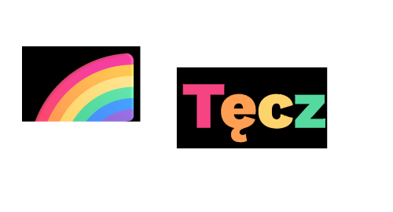

<div align="center">
  
</div>
<p align="center">
  <a href="https://github.com/asterixix/tecza-app/stargazers">
    
  </a>
  <a href="https://github.com/asterixix/tecza-app/network/members">
    
  </a>
  <a href="https://deepscan.io/dashboard#view=project&tid=26785&pid=29370&bid=943878"></a>
  <a href="https://github.com/asterixix/tecza-app/issues">
    
  </a>
  <a href="./LICENSE.md">
    
  </a>
</p>

## Tęcza.app — Razem tworzymy kolorową przyszłość!

Tęcza.app to Progressive Web App (PWA) zbudowana na Next.js 15 i Supabase, projektowana jako bezpieczna, kolorowa i włączająca przestrzeń dla polskiej społeczności LGBTQ.

Repozytorium (nie)zawiera działające(go) MVP z fundamentami profili, postów, znajomych oraz logowania, wraz z planowanymi rozszerzeniami społeczności i wydarzeń. (co "nie" to będzie jak czas i energia pozwoli).

## Stack obecny

- Next.js 15 (App Router, Server/Client Components)
- Tailwind CSS v4 + shadcn/ui (dostępność i mobile-first)
- next-themes (Dark/Light/System)
- next-pwa (PWA, service worker, offline)
- Supabase (Auth, Database/RLS, Storage)
- React Hook Form + Zod (formularze i walidacja)

## Funkcje (MVP)

- Strona główna po polsku, dostępna i responsywna, z trybem ciemnym -> DONE
- Logowanie/rejestracja/reset hasła (OAuth scaffolding: Google/Discord) -> PRAWIE DONE (SZLIFOWANIE)
- Pulpit z tworzeniem postów i kanałem postów (RLS egzekwuje widoczność) -> IN PROGRESS
- Profile użytkowników i Ustawienia (edycja danych, prywatność) -> IN PROGRESS
- Publiczne profile pod /u/[username] (bio, znaczniki, linki, posty) -> PRAWIE DONE (SZLIFOWANIE)
- Połączenia/znajomi: aktywne krawędzie i (nowe) zaproszenia (pending/accept) -> IN PROGRESS
- Upload avatar/okładka do Supabase Storage (publiczne URL-e) -> IN PROGRESS
- PWA: instalowalna, SW z cache (w tym dev wskazówki do resetu) -> PLANNED
- 2FA/TOTP UI i pełny przepływ -> PLANNED
- Markdown i link previews w postach/komentarzach -> PLANNED
- Społeczności i Wydarzenia (lokalne, wsparcie, aktywizm) -> PLANNED
- Wiadomości prywatne i grupowe (Realtime) -> PLANNED
- Moderacja treści i zgłoszenia (AI + manual) -> IN PROGRESS
- Stories/Status, Marketplace/Resources, Live streaming -> PLANNED

## Szybki start (dev)

Wymagania: Node 18+, npm, oraz (opcjonalnie) Supabase CLI dla lokalnej bazy.

1. Zależności i środowisko

- Zainstaluj zależności i utwórz plik `.env.local`:

```
NEXT_PUBLIC_SUPABASE_URL=your-project-url
NEXT_PUBLIC_SUPABASE_ANON_KEY=your-anon-key
```

2. Uruchom tryb deweloperski

```
npm run dev
```

Otwórz http://localhost:3000

3. Build produkcyjny

```
npm run build
npm run start
```

## PWA i SW (pomoc w dev)

Jeśli CSS lub UI wyglądają „stale” w dev, wyrejestruj service worker i wyczyść cache (DevTools → Application → Service Workers → Unregister; Clear storage). Następnie twardy reload.

## Dostępność i i18n

- Polskie UI jako domyślne, semantyczne landmarki, focus rings, aria-labels
- Mobile-first layout i WCAG 2.1

## Wkład i bezpieczeństwo

- Zobacz CONTRIBUTING.md (style, PR, standardy UI/UX, migrations)
- Zobacz SECURITY.md (odpowiedzialne ujawnianie)

## Licencja

Projekt jest na licencji MIT — szczegóły w LICENSE.
